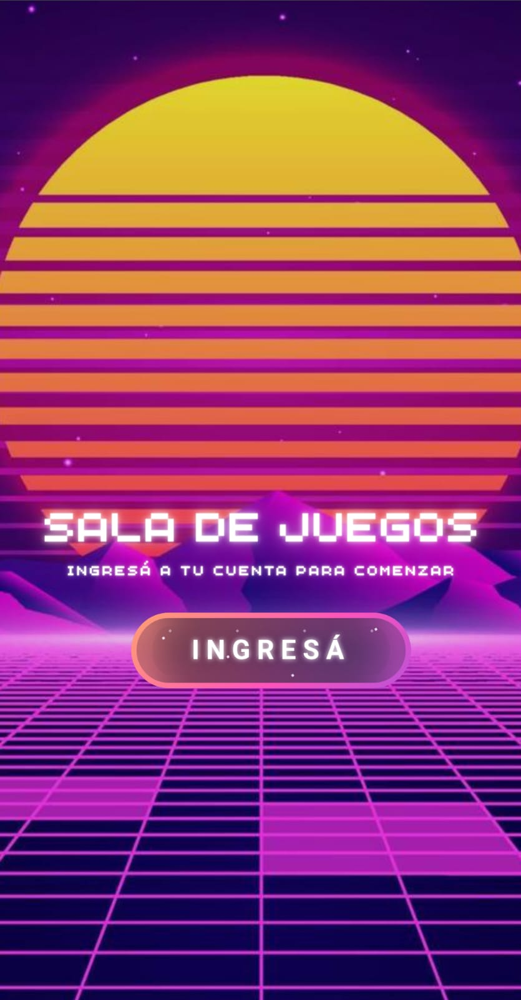
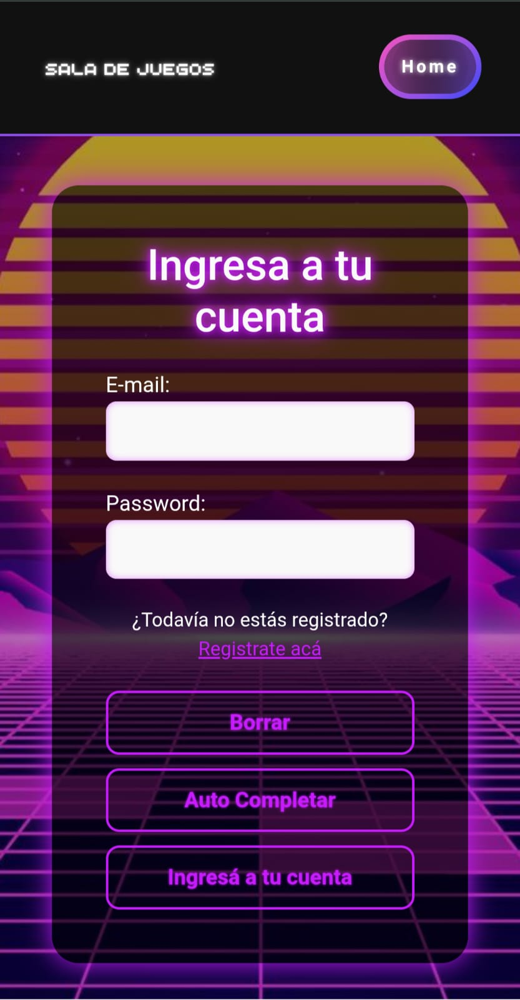
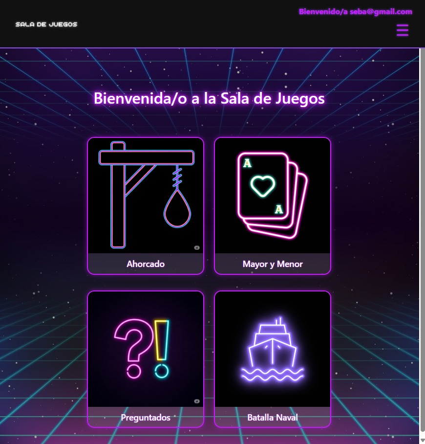
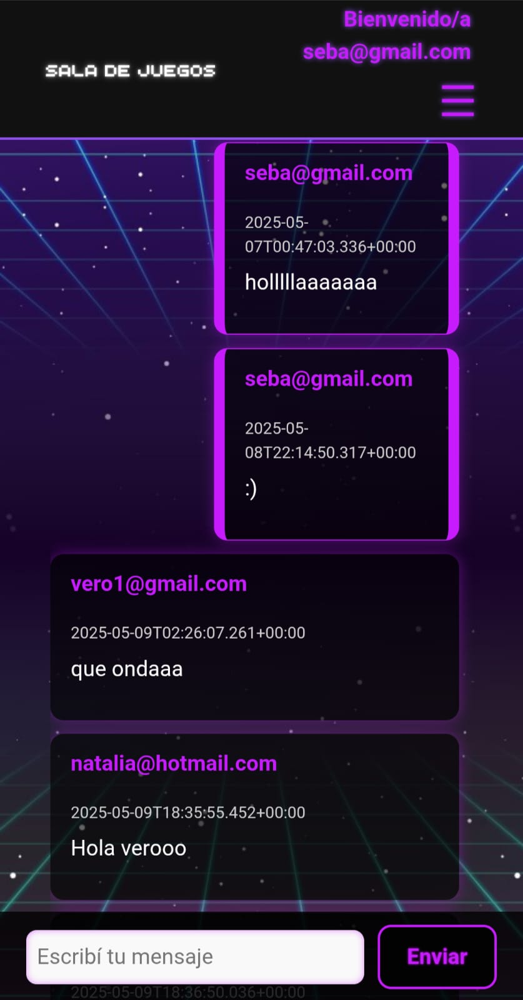
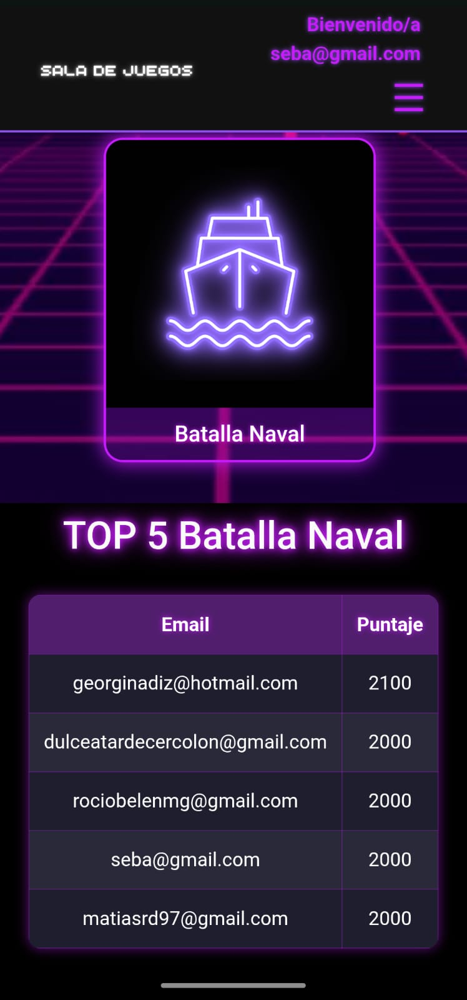
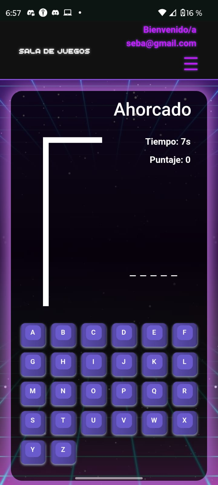
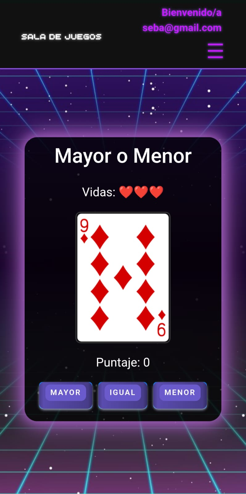
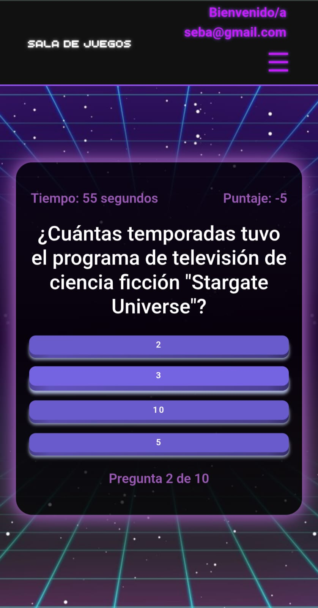
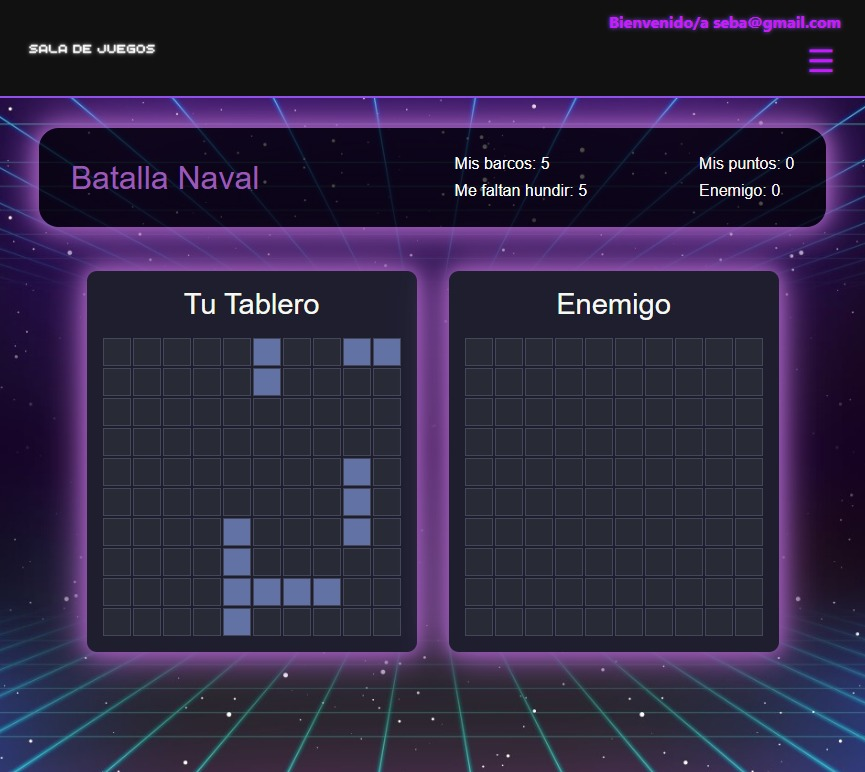

# 🎮 Sala de Juegos — Angular CLI

> Ahorcado · Mayor/Menor · Preguntados · Batalla Naval · Chat en tiempo real · Sala de puntajes

&#x20;&#x20;

## 🔗 Demo

**Live:** [https://tp-1-sala-de-juegos-seven.vercel.app/home](https://tp-1-sala-de-juegos-seven.vercel.app/home)

---

## ✨ Características

* Cuatro juegos integrados en una **misma sala**:

  * **Ahorcado** 
  * **Mayor / Menor** (rápidas rondas de cartas)
  * **Preguntados/Trivia** (categorías, temporizador, feedback)
  * **Batalla Naval** (tablero, colocación de barcos, turnos)
* **Chat en tiempo real** para toda la sala.
* **Sala de puntajes** por juego.
* UI responsive.

---

## 🖼️ Screenshots

| Vista               | Imagen |
|---------------------|--------|
| Home / Lobby        |  |
| Ingreso             |  |
| Juegos              |  |
| Chat en tiempo real |  |
| Sala de puntajes    |  |
| Ahorcado            |  |
| Mayor / Menor       |  |
| Preguntados         |  |
| Batalla Naval       |  |
| Bio                 |  |


>

---

## 📦 Tech

* **Frontend:** Angular (CLI), TypeScript, RxJS, Angular Router, SCSS
* **Realtime:** WebSocket (Socket.IO / SignalR)

---

## 🚀 Arranque rápido

### Requisitos

* Node 18+ (recomendado LTS)
* Angular CLI `npm i -g @angular/cli`

### Instalar y correr

```bash
npm install
npm run start        # ng serve
# o
ng serve -o
```

### Scripts útiles

```json
{
  "scripts": {
    "start": "ng serve",
    "build": "ng build",
    "test": "ng test",
    "lint": "ng lint",
    "prod": "ng build --configuration production"
  }
}
```

---

## 🕹️ Juegos (mini‑guía)

* **Ahorcado:** ingresa letras, contador de intentos, reveal al finalizar.
* **Mayor/Menor:** predice si la siguiente carta será mayor o menor; rachas suman bonus.
* **Preguntados:** categorías, temporizador, feedback inmediato, ranking por aciertos.
* **Batalla Naval:** turnos alternos, hits/misses y fin por hundimiento total.

---

## 🏆 Puntajes

* Tabla  por juego.
* Actualizaciones en tiempo real.

---

## 🔐 Autenticación (opcional)

* Login/Guest para identificar jugadores en chat y ranking.
* Guardas de ruta: `canActivate` para secciones privadas.

---


## 📬 Contacto

Si te gusta el proyecto o querés colaborar:

* **Autora:** Verónica Castillo
* **LinkedIn:** [https://www.linkedin.com/in/veronica-l-castillo](https://www.linkedin.com/in/veronica-l-castillo)
* **GitHub:** [https://github.com/VGdC15](https://github.com/VGdC15)

---

###
